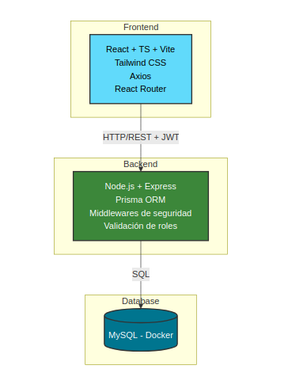
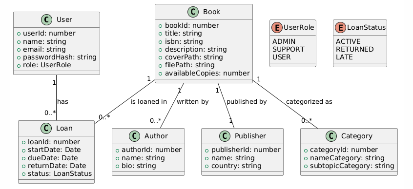
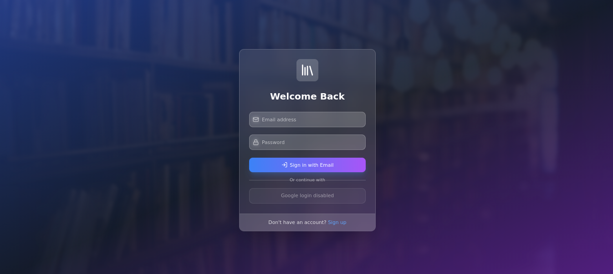
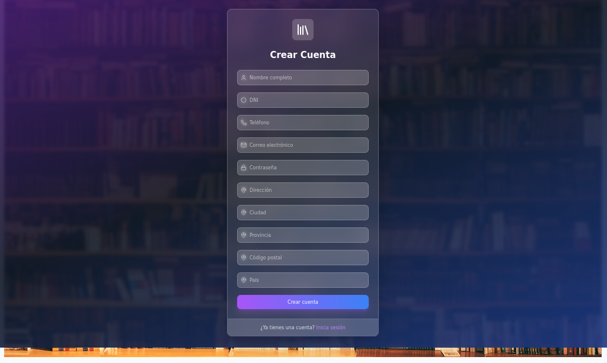
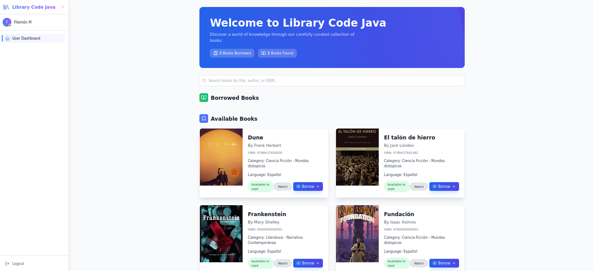
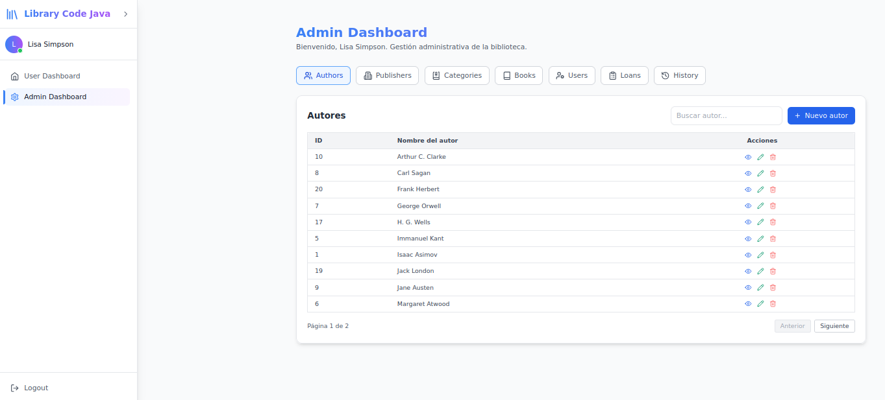
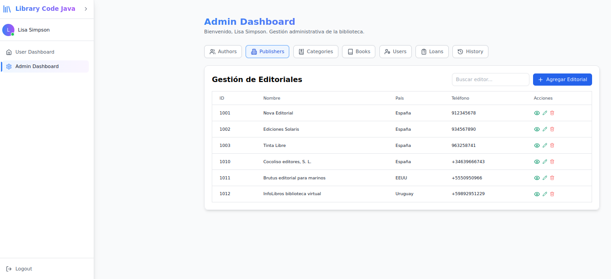
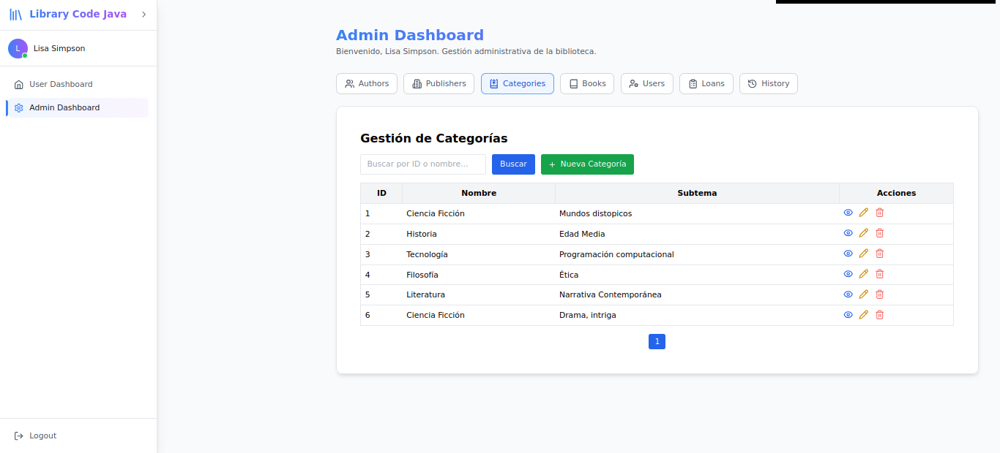
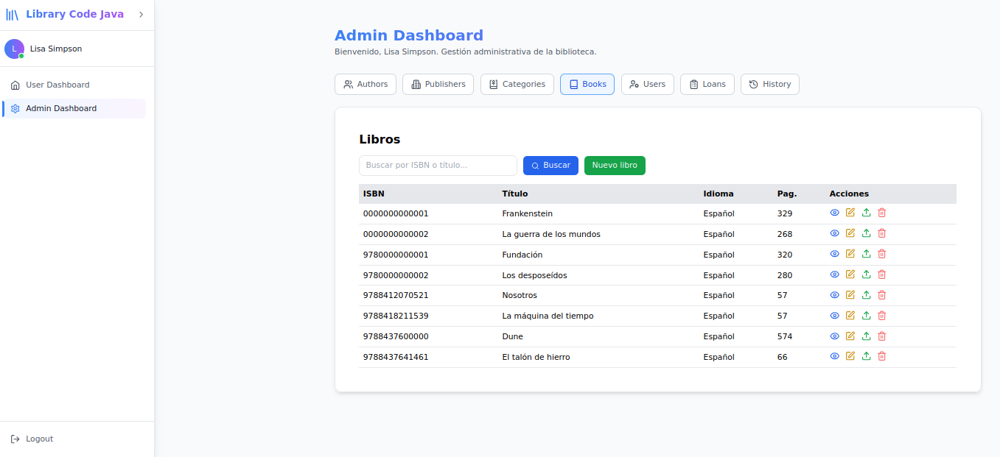
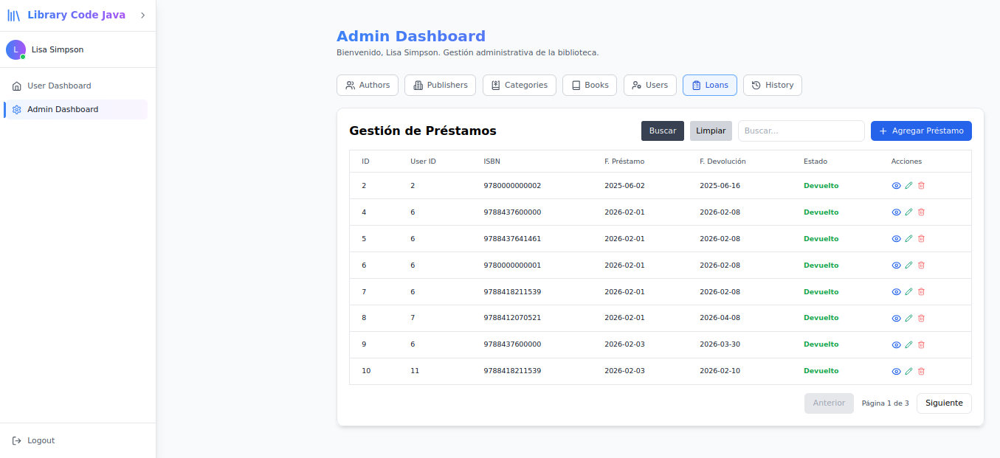

# 📚 Sistema de Gestión de Bibliotecas / Librerías.

<div align="center">
  
  
  
  
  
</div>


Proyecto basado en el trabajo original del Sr. Harsh Rathod, quien desarrolló un sistema moderno de biblioteca online con React, Firebase y Tailwind CSS.
Repositorio original: https://github.com/panduthegang

Esta versión reemplaza completamente Firebase por un backend propio en Node.js, con persistencia en MySQL dentro de Docker, ampliando funcionalidades, seguridad y arquitectura.

    Mi respeto y agradecimiento al Sr. Harsh Rathod por su trabajo original.

## 📑 Tabla de Contenidos.

  -  ✨ Características

  -  🏗️ Arquitectura del Sistema

  -  🔒 Seguridad

  -  🧩 Módulos Implementados

  -  🛠️ Tecnologías

  -  📂 Estructura del Proyecto

  -  🔐 Flujo de Autenticación

  -  🚀 Instalación y Ejecución

  -  📱 Capturas

  -  🗺️ Roadmap

  -  🤝 Contribución

  -  📄 Licencia

  -  👨‍💻 Autor


## ✨ Características principales.

🔐 **Autenticación & Autorización.**

- Login seguro mediante correo y contraseña.

- Acceso protegido mediante JWT con expiración de 1 hora.

- Control de acceso basado en roles: ADMIN, SUPPORT, USER.

- Protección de rutas en frontend y backend.

- Validación estricta del token y del rol en cada endpoint.

📖 **Gestión de Libros.**

- Catálogo completo con portadas e información basada en ISBN.

- Control de disponibilidad en tiempo real.

- Subida de archivos PDF y portadas JPG al backend.

- Gestión de inventario.

👥 **Funciones del usuario.**

- Préstamo y devolución de libros.

- Seguimiento de la fecha de vencimiento.

- Panel personal.

⚡ **Funciones de Administrador.**

- Gestión de autores, editores, categorías y usuarios.

- Administración de préstamos.

- Control total del inventario.

🎨 **UI/UX Moderna.**

- Diseño responsivo.

- Animaciones suaves con Framer Motion.

- Modo oscuro.

- Interfaz clara e intuitiva.


## 🏗️ Arquitectura del Sistema.




## 🧬 Diagrama UML (Modelo de Dominio).




## 📘 Tabla de Endpoints.

| Recurso      | Método | Endpoint                         | Descripción                               | Roles permitidos        |
|--------------|--------|-----------------------------------|-------------------------------------------|--------------------------|
| **Auth**     | POST   | `/auth/login`                    | Login, devuelve JWT                       | Público                  |
| **Auth**     | POST   | `/auth/register`                 | Registro de usuario                       | Público / ADMIN          |
| **Users**    | GET    | `/users`                         | Listar usuarios                           | ADMIN, SUPPORT           |
| **Users**    | GET    | `/users/id/{id}`                 | Detalle de usuario                        | ADMIN, SUPPORT           |
| **Users**    | POST   | `/users`                         | Crear usuario                             | ADMIN                    |
| **Users**    | PUT    | `/users/id/{id}`                 | Actualizar usuario                        | ADMIN, SUPPORT (limit.)  |
| **Users**    | DELETE | `/users/id/{id}`                 | Borrar usuario                            | ADMIN                    |
| **Books**    | GET    | `/books`                         | Listar libros                             | Todos (con token)        |
| **Books**    | GET    | `/books/id/{id}`                 | Detalle de libro                          | Todos                    |
| **Books**    | GET    | `/books/isbn/{isbn}`             | Buscar por ISBN                           | Todos                    |
| **Books**    | POST   | `/books`                         | Crear libro                               | ADMIN, SUPPORT           |
| **Books**    | PUT    | `/books/id/{id}`                 | Actualizar libro                          | ADMIN, SUPPORT           |
| **Books**    | DELETE | `/books/id/{id}`                 | Borrar libro                              | ADMIN                    |
| **Authors**  | GET    | `/authors`                       | Listar autores                            | ADMIN, SUPPORT           |
| **Authors**  | GET    | `/authors/id/{id}`               | Detalle de autor                          | ADMIN, SUPPORT           |
| **Authors**  | POST   | `/authors`                       | Crear autor                               | ADMIN, SUPPORT           |
| **Authors**  | PUT    | `/authors/id/{id}`               | Actualizar autor                          | ADMIN, SUPPORT           |
| **Authors**  | DELETE | `/authors/id/{id}`               | Borrar autor                              | ADMIN                    |
| **Publishers** | GET  | `/publishers`                    | Listar editores                           | ADMIN, SUPPORT           |
| **Publishers** | GET  | `/publishers/id/{id}`            | Detalle de editor                         | ADMIN, SUPPORT           |
| **Publishers** | POST | `/publishers`                    | Crear editor                              | ADMIN, SUPPORT           |
| **Publishers** | PUT  | `/publishers/id/{id}`            | Actualizar editor                         | ADMIN, SUPPORT           |
| **Publishers** | DELETE | `/publishers/id/{id}`          | Borrar editor                             | ADMIN                    |
| **Categories** | GET  | `/categories`                    | Listar categorías                         | ADMIN, SUPPORT           |
| **Categories** | GET  | `/categories/id/{id}`            | Detalle de categoría                      | ADMIN, SUPPORT           |
| **Categories** | GET  | `/categories/name/{name}`        | Buscar por nombre                         | ADMIN, SUPPORT           |
| **Categories** | POST | `/categories`                    | Crear categoría                           | ADMIN, SUPPORT           |
| **Categories** | PUT  | `/categories/id/{id}`            | Actualizar categoría                      | ADMIN, SUPPORT           |
| **Categories** | DELETE | `/categories/id/{id}`          | Borrar categoría                          | ADMIN                    |
| **Loans**     | GET   | `/loans`                         | Listar préstamos                          | ADMIN, SUPPORT           |
| **Loans**     | GET   | `/loans/id/{id}`                 | Detalle de préstamo                       | ADMIN, SUPPORT           |
| **Loans**     | GET   | `/loans/user/{userId}`           | Préstamos de un usuario                   | ADMIN, SUPPORT, USER(*)  |
| **Loans**     | POST  | `/loans`                         | Crear préstamo                            | ADMIN, SUPPORT           |
| **Loans**     | PUT   | `/loans/id/{id}`                 | Actualizar préstamo                       | ADMIN, SUPPORT           |
| **Loans**     | PUT   | `/loans/id/{id}/return`          | Marcar devolución                         | ADMIN, SUPPORT           |

> \* USER solo puede ver sus propios préstamos.


## 🔒 Seguridad.

✔ **Autenticación.**

- JWT firmado con clave secreta.

- Expiración de 1 hora.

- Renovación mediante login.

✔ **Autorización por roles.**

- USER → acceso al panel de usuario.

- SUPPORT → acceso a paneles de administración, sin permisos destructivos.

- ADMIN → control total del sistema.

✔ **Protección en backend.**

- Middlewares:

    - verifyToken

    - verifyRole

    - validateUserExists

- Prevención de autopromoción de roles.

- Validación estricta de parámetros y payloads.

✔ **Protección en frontend.**

- Rutas protegidas con ProtectedRoute.

- Ocultación de acciones según rol.

- Validación del token en cada llamada Axios.


## 🧩 Módulos Implementados.

✔ **Usuarios**
✔ **Libros**
✔ **Autores**
✔ **Editores**
✔ **Categorías**
✔ **Préstamos**
✔ **Dashboard de usuario**
✔ **Dashboard de administrador**
✔ **Gestión de portadas y PDFs**
✔ **Seguridad avanzada por roles**


## 🛠️ Tecnologías utilizadas.

**Frontend**

- ⚛️ React 18 + TypeScript

- 🎨 Tailwind CSS

- 🎭 Framer Motion

- 📦 Vite

- 🔌 Axios

- 🐬 MySQL (Docker)

- 🟦 Node.js + Express + Prisma ORM

- 🟧 Spring Boot (versión alternativa en desarrollo)

**Backend**

- 🟩 Node.js + Express

- 🟦 Prisma ORM

- 🐬 MySQL (Docker)

- 🔐 JWT + Middlewares de seguridad

**Otros**

- 🐳 Docker

- 🧪 Postman (pruebas de API)


## 📂 Estructura del Proyecto.

```bash

src/
 ├─ components/
 ├─ pages/
 │   ├─ login/
 │   ├─ dashboard/
 │   ├─ admin/
 │   └─ categories/
 ├─ services/
 │   ├─ books.service.ts
 │   ├─ users.service.ts
 │   ├─ categories.service.ts
 │   └─ loans.service.ts
 ├─ utils/
 │   ├─ auth.storage.ts
 │   └─ helpers.ts
 └─ App.tsx
´´´

## 🔐 Flujo de Autenticación.

1. Usuario envía credenciales (email + password)
2. Backend valida credenciales
3. Backend genera JWT (1h)
4. Frontend guarda token en localStorage
5. Axios envía token en cada petición
6. Backend valida token + rol
7. Acceso permitido o denegado


## 🚀 Instalación y ejecución.

1. **Clonar el repositorio frontend en local.**

```bash
git clone https://github.com/DEVSAM1966/Biblioteca-codigojava-front.git
cd Biblioteca-codigojava-front
```

2. **Instalar dependencias.**

```bash
npm install
```

3. **Clonar el repositorio backend en local.**

```bash
git clone https://github.com/DEVSAM1966/Biblioteca-code-cafe.git
```

    ⚠ Sigue las instrucciones del README del backend para configurar Docker, Prisma y la BD.


4. **Arrancar Docker (MySQL).**

Para usuarios de Linux.

```bash
sudo systemctl start docker
```

Para usuarios de Windows.

- Abrir Docker Desktop

- Iniciar el contenedor biblio_mysql


5. **Iniciar backend.**

```bash
npm run dev
```

6. **Iniciar frontend.**

```bash
npm run dev
```

## 📱 Capturas de pantalla.

### Login.


### Registro de un usuario por si mismo.


### Interfaz de usuario.


### Panel de administración - autores.


### Panel de administración - editores.


### Panel de administración - categorias.


### Panel de administración - libros.


### Panel de administración - prestamos.


## 🔒 Seguridad

- Verificación del rol asignado al usuario y de su existencia en BD.
- Acceso por Token JWT (limitado su vida util en 1 hora).
- Limitaciones del uso segun el rol que tenga.
- USER.  Acceso al panel de usuario.
- SUPPORT. Acceso a los paneles de usuario, administración.  No podrá borrar registros de la BD ni autopromocionarse como ADMIN.
- ADMIN. Acceso a los paneñes de usuario, administracion.  Puede borrar registros.


## 🗺️ Roadmap.

🔜 **Próximas mejoras.**

- Mejor visualización de préstamos en el panel de usuario.

- Dashboard avanzado con estadísticas.

- Integración con backend Spring Boot.

- Sistema de notificaciones por correo.

- Exportación de informes.

- Tests unitarios y de integración.


## 🤝 Contribución.

Las contribuciones son bienvenidas.
Para colaborar:

1. Haz un fork del repositorio.

2. Crea una rama con tu mejora.

3. Envía un Pull Request.

4. Avisa del PR, al correo electrónico: **desarrollo.devsam@gmail.com**


## 📄 Licencia.

Este proyecto se distribuye bajo la licencia MIT.


# Autor.

**Sebastián Asunción** - **desarrollo.devsam@gmail.com**

---

<div align="center">Thanks for ❤️ Harsh Rathod</div>

